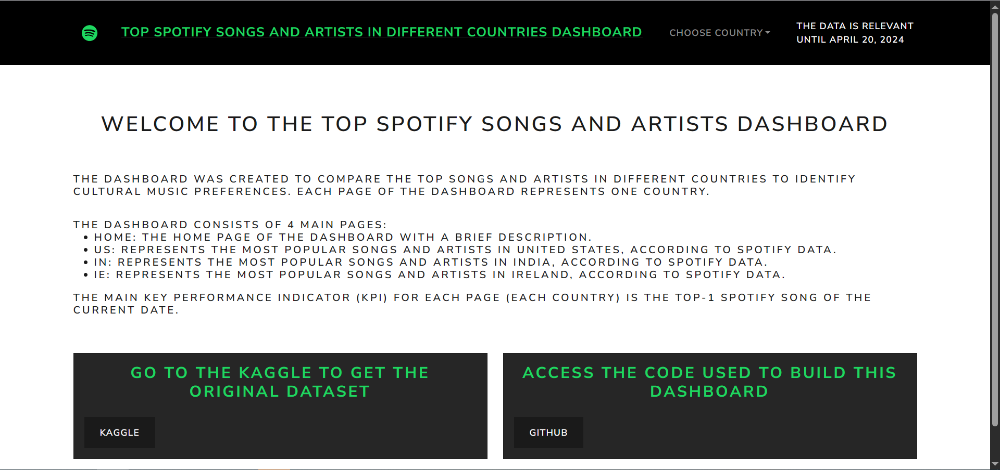
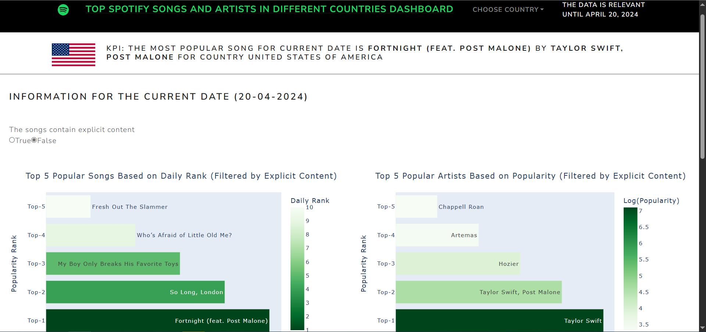
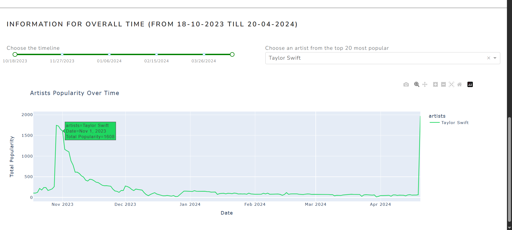

# Top Spotify songs and artists dashboard (among USA, India and Ireland)
This is the repository to store all the necessary files used to build multi-page interactive dashboard using Dash and Plotly python-libraries.


## Repository structure
- folder apps: to store pages for each country (US, IN, IE) and home page
- folder assets: to store png files and css file (to edit styles of some Dash elements)
- folder _pycache__: autogenerated folder for storing cashe of python launched files (not necessary)
- folder img: dashboard screenshots
- index.py: file that we run to generate the dashboard and get the local link
- app.py: we need it to successfully run index.py
- data_preprocessing.py: data cleaning, wrangling and splitting into 3 datasets (by different countries):
    - US.csv: represents Spotify data for United States of America
    - IN.csv: represents Spotify data for India
    - IE.csv: represents Spotify data for Ireland
- requirements.txt: requirements for python libraries
- Report.pdf: short report of the project

## Project Summary
This dashboard presents an interactive visualization aimed at music industry stakeholders and enthusiasts looking to explore trends in popular music across different countries. It allows users to compare top songs and artists, reflecting cultural preferences and market dynamics. By presenting a user-friendly interface with a clear and concise layout, the visual tool engages its audience—ranging from music producers to marketing professionals—in identifying the latest hits and top performers on Spotify.

## Data source and brief description of data.
### Data description:
Dataset was taken from Kaggle (https://www.kaggle.com/datasets/asaniczka/top-spotify-songs-in-73-countries-daily-updated/data). The following columns were used within this project for building interactive visualizations:
- name: The title of the song. (type: str)
- artists: The name(s) of the artist(s) associated with the song. (type: str)
- daily_rank: The daily rank of the song in the top 50 list. (type: int)
- country: The ISO code of the country of the Top 50 Playlist. (type: str)
- snapshot_date: The date on which the data was collected from the Spotify API.
- is_explicit: Indicates whether the song contains explicit lyrics. (type: bool)
### Data wrangling:
When exploring the dataset, I noticed that there were so many songs with popularity = 0, while they are located in the top-50 of Spotify songs (this was especially true of the singer Taylor Swift). That why, I decided to drop this ‘popularity’ column and create my own one, that the linear function of ‘daily_rank’ column. This is fair enough, since daily_rank reflects the current popularity of the song. So, I used following formula:
```bash
popularity = 100 - (daily_rank - 1) * 2,
```
so, the range of popularity is [2 - 100].
So, we add column ‘popularity’:
- popularity: A measure of the song's current popularity on Spotify. (type: float)
Otherwise, no data collection errors, or missing values were noticed in the columns of interest.

## Short criticism
### Main challenges:
1. Since I don't have enough experience in css, it was quite difficult for me to find the right approaches to editing the styles of some HTML or Dash elements. For example, it took a lot of time to find the proper way to edit the style of RangeSlider (from dash_bootstrap_components) so it has the green color, instead of blue, to match with regular green Spotify Design.
2. Plotly is a new python library for me to build interactive visualization with huge amount of customization. On the other hand, it gives you the opportunity to design and customize graphs to get sophisticated visualization. On the other hand, due to lack of experience and so many opportunities for plots customization, at first, I didn't know where to start. But then I started to gradually learn Plotly library, explore some ready examples of beautiful visualizations made with Plotly and successfully overcame this challenge.
### Strengths:
1. The dashboard's design is a significant strength, inspired by Spotify's elegant and recognizable aesthetic. This not only provides users with a familiar navigation experience, but also creates an immediate visual association with the brand, which can be especially attractive to users familiar with the Spotify platform.
2. Interactivity is another robust feature of the dashboard. The ability to interact with fields and sliders allows for dynamic data exploration. Users can select a country (United States, India, Ireland), and explore the music trends for this specific country with ability to choose whether to consider the songs that contain explicit content or not, as well as to select the specific artist and adjust time ranges to investigate how the artist’s popularity was varying over time.
### Weaknesses:
1. There are not enough visualization for each country to come up with some sophisticated insights, for example the dataset allows to investigate whether there is a correlation between song popularity and its danceability or energy level. This is also an interesting way to explore the Spotify trends that could be made.
2. The number of countries could be greater than just 3. Also, global data was not included in the dashboard.

## Link to a server hosted version
https://spotify-python-dashboard-6.onrender.com

## Basic version history:
v1.0: Dashboard Design in Power Point
v2.0: Create the home page
v2.1: Create the US page (USA)
v2.2: Create the IN page (India)
v2.3: Create the IE page (Ireland)
v3.0: Combining files to make the multi-page dashboard

## Future work:
1. Add more countries to come up with more robust and considerable insights in terms of comparing music trends between countries
2. Add page in the dashboard about global music trends and patterns on Spotify all over the world.


## Some screenshots of the dashboard:
#### Home page:


#### Page US:

